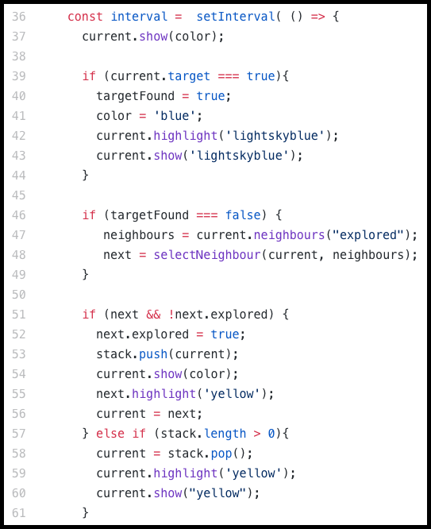

# A-Mazing Game
[Live Site!](https://arittrosaha.github.io/A-Mazing-Game/)

Note - The application is hosted in GitHub.

**_If you find a bug or have a recommendation to make this application better, please contact me through GitHub or my email, arittrosaha@gmail.com. Thank you very much!_**

---
## Summary
**Synopsis** - It is a maze game and a graph algorithm simulator that uses algorithms and data structures to generate and solve mazes while also giving an option for a player to solve the maze by themselves. It is coded with vanilla JS and rendered using HTML5 Canvas.

**Stack** - Vanilla JS, HTML5, CSS3, Canvas.

**Key Points**:
* Implemented graph traversal algorithms such as DFS and BFS to generate and solve mazes.
* Built a customized algorithm to calculate the 2D position of a node in a 1D array.
* Performed dynamic DOM manipulation with just vanilla JavaScript.

---
## How does it work?

Step 1 (Generate Maze) - Select difficulty level between Easy, Medium and Hard to generate an easy, medium or hard maze respectively. All levels of maze generation is done using a DFS algorithm, currently.

Step 2 (Solve Maze) - Select a mode to solve the maze from the following options:
* DFS - The maze will be solved using a DFS algorithm.
* BFS - The maze will be solved using a BFS algorithm.
* Solve Yourself - Use the up, down, left and right arrow keys to navigate through the maze. But if you hit a wall, you will start over.

---
## Detailed Breakdown
### Keys

* **White** indicates walls.
* **Red** indicates maze path.
* **Light Blue** indicates the target or finish.
* **Gree** indicates portion of the maze that has been explored.
* **Dark Blue** indicates the shortest path from finish to back start.

---
### Setup
Grid | Cell
-----|-----
|

**Grid** - Usually grids, when made with array, are made with a 2D array. However, for this project, I did it with a 1D array by having each Cell's position (i, j) saved as attributes with in them.
* Function SetupGrid is used to make the grid by creating all Cell objects necessary.
* The width provided to the function determines the density of the grid when divided by the width (a constant) of the Canvas itself which is 500px.
  * Easy - width is 50; 500/50 = 10 x 10 cells
  * Medium - width is 20; 500/20 = 25 x 25 cells
  * Hard - width is 10; 500/10 = 50 x 50 cells

**Cell** - Each cell carries the following information:
  * Position (i, j)
  * If the cell is visited or not for aiding in generation rendering
  * If the cell is explored or not for aiding in solving rendering
  * [true/false, true/false, true/false, true/false] stores the presence or lack there of top, right, bottom, left wall respectively.
  * If the cell is a target or not.
  * The cell's parent
  * The cell's children or as its called here, neighbours.
  * The Cell object has other instance function called show for rendering it in canvas accurately based on the above information (its different attributes).

---
### Generate Maze
Render | Code Snippet
-------|-------------
|

**Render** - This is a visualization of a generating maze with DFS after the Hard button is pressed.

**Code Snippet** - This is a portion of the code to render and create a maze using HTML5 Canvas and DFS algorithm, respectively. This is an iterative implementation of DFS.
* Animation rate - The need for a continuous loop and a way to control the rate of animation is achieved by the use of setInterval asynchronous function. While 0 milliseconds is passed in this setInterval function (code not visible in this snippet), the minimum default time value is 4ms for HTML5. Therefore, the frame rate is 1 frame per 4 ms.
* Line 41 to 55 - The main portion of the code handling the DFS logic.
* Line 57 and bellow - Selects a random target from the last row.

---
### Solve Maze

<table>
  <tr>
    <td align="center" colspan="2"><b>DFS Solve</b></td>
  </tr>
  <tr>
    <td align="center"><b>Render</b></td>
    <td align="center"><b>Code Snippet</b></td>
  </tr>
  <tr>
    <td></td>
    <td></td>
  </tr>
</table>

**Render** - This is a visualization of solving a hard maze with DFS. Yellow is the current location.

**Code Snippet** - This is a portion of the code to render and solve a maze using HTML5 Canvas and DFS algorithm, respectively. This is an iterative implementation of DFS.
* Animation rate - The need for a continuous loop and a way to control the rate of animation is achieved by the use of setInterval asynchronous function. While 0 milliseconds is passed in this setInterval function (code not visible in this
* Line 39 to 44 - After target is found, this code ensures line 46 to 49 are skipped, triggering a recursive backtrack to the start indicating the shortest way back.
* Line 46 to 56 - The main portion of the code handling the DFS logic.
* Line 57 to 61 - The portion that handles back tracking to the start postion once target is found revealing the shortest path from start to finish.
---
<table>
  <tr>
    <td align="center" colspan="2"><b>BFS Solve</b></td>
  </tr>
  <tr>
    <td align="center"><b>Render</b></td>
    <td align="center"><b>Code Snippet</b></td>
  </tr>
  <tr>
    <td></td>
    <td></td>
  </tr>
</table>

**Render** - This is a visualization of solving a hard maze with BFS. Yellow is the current location.

**Code Snippet** - This is a portion of the code to render and solve a maze using HTML5 Canvas and BFS algorithm, respectively.
* Animation rate - The need for a continuous loop and a way to control the rate of animation is achieved by the use of setInterval asynchronous function. While 0 milliseconds is passed in this setInterval function (code not visible in this
* Line 48 to 73 - The main portion of the code handling the BFS logic.
* Line 75 to 78 - Once target is found, it back tracks using each cell's parent to reveal the shortest path from start to finish.
---
<table>
  <tr>
    <td align="center" colspan="2"><b>Solve Yourself</b></td>
  </tr>
  <tr>
    <td align="center"><b>Render</b></td>
    <td align="center"><b>Code Snippet</b></td>
  </tr>
  <tr>
    <td></td>
    <td></td>
  </tr>
</table>

**Render** - This is a visualization of solving an Easy maze by yourself. Yellow is the current location.

**Code Snippet** - This is a portion of the code to render and handle key inputs by HTML5 Canvas and vanilla JavaScript event listeners for keys, respectively. I have utilized switch and case syntax to handle what needs to be done when respective keys are pressed.
* Line 21 to 35 :
  * Line 22 - current cell is pushed to previousPath so it can rendered as explored.
  * Line 23 - newCurrent cell is selected based on the key pressed.
  * Line 25 - if a newCurrent is found, current is reassigned with the newCurrent. 
  * Line 26 to 29 : if current is the target, it triggers an automatic path back to start revealing the shortest path from start to finish.
  * Line 31 to 34 : if newCurrent was not found because the pressed key encountered an obstacle, either a wall or an edge of the maze, this portion of the code penalizes the player by starting the game all over again.

---
## Future Plans
### Generating the maze
A player will need to make two choice to generate a map:
* A Difficulty level from Easy, Medium or Hard
* An Algorithm from DFS, BFS, Kruskal's, Prim's or Obstacle based test cases for A*

### Solving the maze
**Algorithms**:
  * Upcoming ones - Dijkstra's, A*, Prim's or Kruskal's
  * Last time, average time and number of times run for the current player to solve the current map will be displayed per algorithm.

**Solving Yourself**:
  * Top 10 lowest time will be displayed alongside a provided username, that is appropriate, per level bellow the map.
  * A countdown will be displayed as soon as a human clicks the Solving Yourself button and will run until the target is reached.
  
### More controls 
  * Give user the control of changing the animation speed of generating and solving mazes with algorithms.
  * Give user an option to use a virtual up, down, left and right button in the case the user wishes to play through a touch screen.
